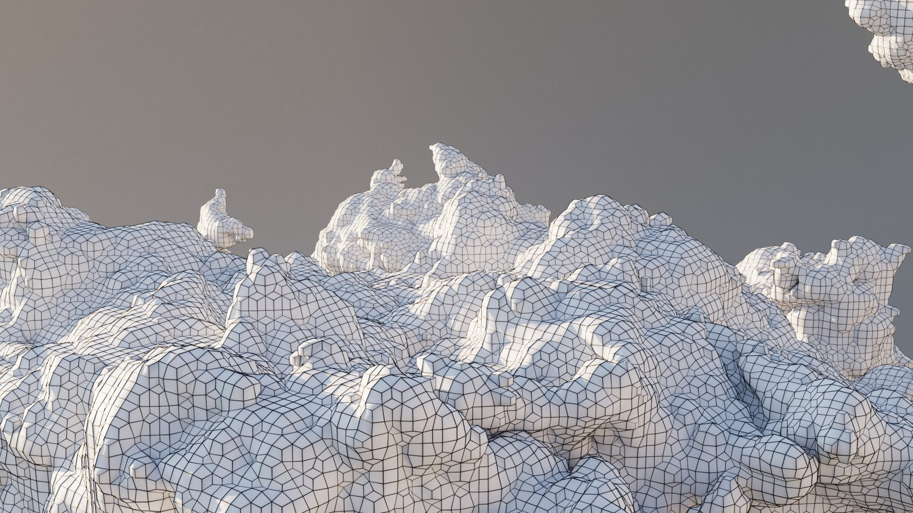

# Story

Our animation will be a scene involving a car driving along side a road with a sun/moon rising and setting. Below the sun but above the road will have clouds that will produce occasionally produce rain and a thunder sound. This sequence will continue on indefinitely. There will also be key presses to control the camera.

# Description of Objects
## Clouds (Jeffrey)
The clouds texture will be imported from a `.obj` file, particularly from https://www.turbosquid.com/3d-models/3d-cloud-polygon-blender-1-model-1895708. Each cloud will move in the direction of the car with a parameter controlling the rain intensity and the thunder intensity. As the cloud moves, the rain will also move with the same horizontal velocity, similar to assignment 4. I will try experimenting with different droplet shapes (ellipse, circle, obj, etc.) and try to animate lightning. However, this proved to be difficult in A4 as I could not find a suitable lightning shape.

> `.obj` of clouds

## Road and Car (Tarun)

## Sun and Moon (Yawer)
The Sun and Moon will be .obj files. They will go along a bezier curve and the background color will be changing from night, day, and sunrise rgb colors using a lerpcolor function. I might create a "dome" that will have stars on it and the sun-moon objects will go on a path along it. I'm not sure how feasable this would be, but the dome would also have stars for night time that sparkle.

# Classes
## Cloud
Like in A4, the cloud position will be controlled by a position vector `pos` and its speed will be controlled by a float `speed` indicating the number of pixels to travel per frame using the `lerp` method. The clouds will move at a linear speed. The parameter `rain_intensity` will control the intensity of the rain and the size of the array that stores the droplets in the `Cloud` class. If lightning is implemented, it will be parameterized with respect to `rain_intensity`. The color of the clouds will be controlled by `rain_intensity` as well, ranging from white to gray depending on the intensity. The number of clouds initialized will vary depending on a global parameter in `setup()`.

## Sun and Moon
The Sun and Moon will be ".obj" files whose x and y coordinates will be determined by a bezier curve using the "bezierPoint" function. The background color will change continuously using "lerpcolor". The speed of the translation across the sky will be hard set and will not change. I will use a boolean value to change switch between the sun and moon. I had difficulties implementing this in A4, but I wanted to have a good way to control the time of day and have that control the background color. I will experiment with this a bit more in this project. 
